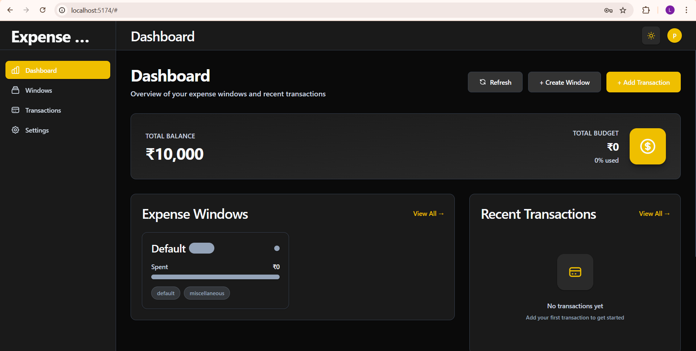
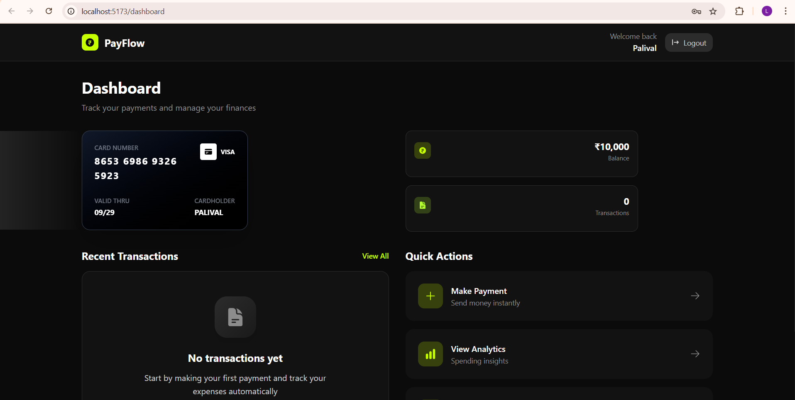
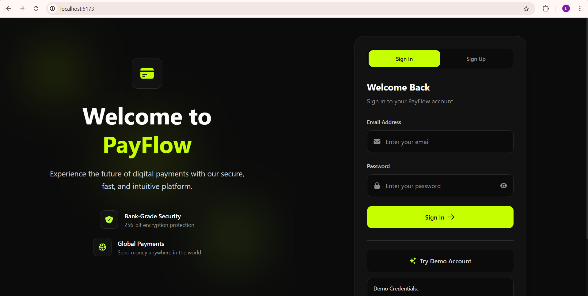

## 🧠 Smart Expense Management System

A **MERN stack** web app designed to manage **shared and personal expenses** effectively.  
It predicts expense categories from payment notes, tracks budgets in real time, and ensures secure user access through **JWT authentication**.

> 🚧 **Status:** Currently under development — upcoming features include AI-based expense categorization, analytics dashboard, and improved UI components.

---

### 💡 Idea
The goal is to simplify how individuals and groups handle their money by providing:
- Automatic category prediction from payment notes  
- Real-time budget tracking and insights  
- Email notifications for budget limits using **NodeMailer**  
- Secure user authentication with **JWT**  
- Clean and responsive UI built with **React.js**  

---

### 🖼️ Screenshots

| Login[Expense-Management] | Dashboard[Expense-Management] | Dashboard[Payment-App] | Login/Signup[Payment-App] |
|------------|---------------|--------------|--------------|
|  |  |  |  |

---

### ⚙️ Tech Stack
- **Frontend:** React.js, Context API, TailwindCSS  
- **Backend:** Node.js, Express.js  
- **Database:** MongoDB  
- **Authentication:** JWT  
- **Email Service:** NodeMailer  

---

### 🧩 Features (Planned & Implemented)
- ✅ Expense tracking with category prediction  
- ✅ Email alerts for overspending  
- 🛠️ AI-based category prediction *(in progress)*  
- 🛠️ Analytics dashboard *(coming soon)*  

---

