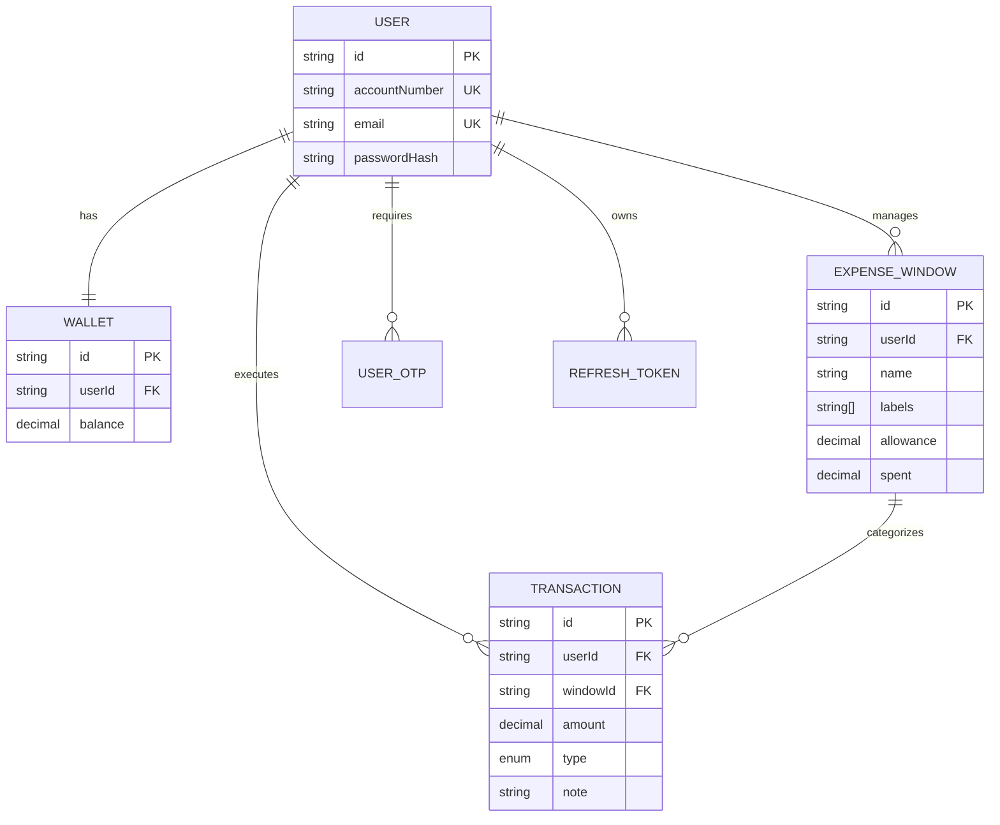

# 💳 Advanced Financial Suite

An enterprise-grade financial management ecosystem featuring an AI-driven backend and dual-specialized frontend applications. This suite provides a robust solution for personal finance tracking, peer-to-peer transfers, and smart expense categorization.

---

## 🏛️ Project Architecture

The suite is divided into three core components, ensuring high scalability and separation of concerns:

- **`sem` (Backend Core)**: Robust Node.js API with AI capabilities.
- **`expense_frontend` (Manager)**: Advanced dashboard for budget tracking and window management.
- **`transaction_frontend` (Portal)**: High-speed interface for peer-to-peer transfers.

---

## 🛠️ Tech Stack & Versioning

### Backend (`sem`)


### Frontends (`expense` & `transaction`)


---

## 🚀 Unique Features

### 🧠 AI-Powered "Magic Matcher"
Unlike traditional systems that rely on strict keywords, this project integrates **Gemini 2.0 Flash** to intelligently categorize transactions based on context. 
> *Example: A note "chai + maskabun" is automatically mapped to the "Food" window even if "chai" isn't a predefined label.*

### 🪟 Smart Expense Windows
Organize your money into virtual "Windows" (e.g., Rent, Daily, Fun).
- **Auto-Categorization**: Incoming debits are automatically routed to the correct window.
- **Dynamic Allowances**: Real-time tracking of spent vs. remaining budget.
- **Threshold Alerts**: System flags when 90% or 100% of a window's budget is consumed.

### 🍱 Multi-Frontend Strategy
- **Manager Portal**: Focused on analytics, window management, and deep history.
- **Transaction Portal**: Optimized for speed—quick transfers and instant balance checks.

---

## 📊 Database Schema (ERD)


```mermaid
erDiagram
    USER ||--|| WALLET : "has"
    USER ||--o{ EXPENSE_WINDOW : "manages"
    USER ||--o{ TRANSACTION : "executes"
    USER ||--o{ USER_OTP : "requires"
    USER ||--o{ REFRESH_TOKEN : "owns"
    
    EXPENSE_WINDOW ||--o{ TRANSACTION : "categorizes"

    USER {
        string id PK
        string accountNumber UK
        string email UK
        string passwordHash
    }

    WALLET {
        string id PK
        string userId FK
        decimal balance
    }

    EXPENSE_WINDOW {
        string id PK
        string userId FK
        string name
        string[] labels
        decimal allowance
        decimal spent
    }

    TRANSACTION {
        string id PK
        string userId FK
        string windowId FK
        decimal amount
        enum type
        string note
    }
```

---

## 🛣️ API Endpoints

### Authentication
- `POST /api/auth/register` - Create new identity.
- `POST /api/auth/login` - Secure access with JWT.
- `POST /api/auth/refresh` - Seamless session extension.

### Financial Operations
- `GET /api/wallet/balance` - Real-time balance fetch.
- `POST /api/transactions/transfer` - P2P money transfer with AI matching.
- `GET /api/transactions/history` - Paginated transaction stream.

### Expense Management
- `GET /api/windows` - List all smart windows.
- `POST /api/windows` - Create new budget window.
- `PATCH /api/windows/:id` - Update labels or allowances.

---

## 🚦 Getting Started

1. **Clone the repository**:
   ```bash
   git clone <repo-url>
   ```

2. **Environment Setup**:
   Copy `.env.example` in `sem` and add your `DATABASE_URL` and `GEMINI_API_KEY`.

3. **Install Dependencies**:
   ```bash
   # Run in each directory
   npm install
   ```

4. **Database Migration**:
   ```bash
   cd sem
   npx prisma migrate dev
   ```

5. **Run Suite**:
   ```bash
   # Backend
   npm run dev
   # Frontends
   npm run dev
   ```

---

## 🛡️ Security Features
- **Rate Limiting**: Protection against brute-force attacks.
- **Security Headers**: Powered by `helmet`.
- **Zod Validation**: Strict schema enforcement for every request.
- **Refresh Token Rotation**: Enhanced session security.

---
